<!-- ─────────────────────────────────────────────────────────────────────── -->
<!--  ☉  olá, leitor de código-fonte. bom sinal você ter aberto isto aqui.  -->
<!--     os SVGs deste perfil saem de scripts/gerar_svgs.py.                -->
<!--     os períodos das órbitas no banner seguem a 3ª lei de Kepler.       -->
<!--     ninguém pediu. eu fiz mesmo assim.                                 -->
<!-- ─────────────────────────────────────────────────────────────────────── -->

<picture>
  <source media="(prefers-color-scheme: dark)" srcset="assets/banner-dark.svg">
  <source media="(prefers-color-scheme: light)" srcset="assets/banner-light.svg">
  
</picture>

<div align="center">

<picture>
  <source media="(prefers-color-scheme: dark)" srcset="https://readme-typing-svg.demolab.com?font=JetBrains+Mono&weight=500&size=20&duration=2800&pause=1400&color=F5B841&center=true&vCenter=true&width=640&height=44&lines=Estudante+de+Engenharia+de+Software+em+Bras%C3%ADlia;Simulo+o+Sistema+Solar+com+efem%C3%A9rides+do+JPL;Levo+fidelidade+para+a+Apple+e+a+Google+Wallet;Escrevo+C+em+2026+%E2%80%94+e+TypeScript+estrito;Se+o+README+afirma%2C+um+teste+prova.">
  <source media="(prefers-color-scheme: light)" srcset="https://readme-typing-svg.demolab.com?font=JetBrains+Mono&weight=500&size=20&duration=2800&pause=1400&color=B7791F&center=true&vCenter=true&width=640&height=44&lines=Estudante+de+Engenharia+de+Software+em+Bras%C3%ADlia;Simulo+o+Sistema+Solar+com+efem%C3%A9rides+do+JPL;Levo+fidelidade+para+a+Apple+e+a+Google+Wallet;Escrevo+C+em+2026+%E2%80%94+e+TypeScript+estrito;Se+o+README+afirma%2C+um+teste+prova.">
  
</picture>

<a href="https://www.linkedin.com/in/thivpb/"></a>&nbsp;<a href="mailto:thivpb@gmail.com"></a>

</div>

---

### `01` — Sobre mim

Sou o **Thiago**, estudante de **Engenharia de Software** em **Brasília, DF**. Gosto de software em que *parecer* funcionar não basta: simulação que precisa bater com o JPL, ponto de fidelidade que não pode sumir, jogo que não pode travar na frente da turma.

Meu jeito de trabalhar cabe numa frase: **se o README afirma, um teste prova.**

```ts
// whoami.ts — strict, sem `any`, e sim: compila.
interface Dev {
  nome: string;
  curso: string;
  base: string;
  agora: readonly string[];
  interesses: readonly string[];
  regra: string;
}

export const thiago = {
  nome: "Thiago Vinícius Brito",
  curso: "Engenharia de Software",
  base: "Brasília, DF 🇧🇷",
  agora: ["Sistema Solar 3D", "Wallet Loyalty (piloto)"],
  interesses: ["simulação física", "gráficos em tempo real", "backend transacional", "jogos em C"],
  regra: "se o README afirma, um teste prova",
} as const satisfies Dev;
```

---

### `02` — Projetos em órbita

<p align="center">
  <a href="https://github.com/thivpb/sistema-solar-3d"></a>
  
  <a href="https://github.com/Felps-26/Disease-s_Doomsday"></a>
  <a href="https://github.com/thivpb/Aequus"></a>
</p>

<sub>Também por aqui: <a href="https://github.com/thivpb/hackathon-01-26"><b>VITAE</b></a> — monitoramento de bem-estar para pessoa idosa, com visão do cuidador, construído num hackathon (React + Vite).</sub>

---

### `03` — Stack

<table>
  <tr>
    <td><b>Linguagens</b></td>
    <td></td>
  </tr>
  <tr>
    <td><b>Gráficos e front</b></td>
    <td><br><sub>+ WebGPU · Preact · React Native · Expo · Raylib · GLSL</sub></td>
  </tr>
  <tr>
    <td><b>Back e dados</b></td>
    <td><br><sub>+ pg-boss · PGlite · outbox transacional</sub></td>
  </tr>
  <tr>
    <td><b>Qualidade</b></td>
    <td><br><sub>+ Playwright · axe-core · dependency-cruiser · TypeScript <code>strict</code></sub></td>
  </tr>
  <tr>
    <td><b>Ferramentas</b></td>
    <td><br><sub>+ Claude Code</sub></td>
  </tr>
</table>

---

### `04` — Como eu trabalho

- **Se o README afirma, um teste prova.** No Sistema Solar 3D, `honestidade.test.ts` amarra cada simplificação declarada a um fato do código, nos dois sentidos — declarar uma licença que não se toma reprova igual a tomar uma que não se declara.
- **Portão antes de tudo.** `npm test` roda tipos estritos, lint, regras de arquitetura, unidade e ponta a ponta, nessa ordem. Caiu um, nada segue.
- **Decisão vira registro.** `DECISIONS.md` e ADRs numeradas: requisito muda por entrada nova no log, não por conversa de corredor.
- **Número ruim, escrito por extenso.** Estimei +60 MB de textura e deu +114 MB? Isso vai para o README, não fica implícito.
- **O que não foi conferido, está escrito que não foi.**

```console
thiago@brasilia:~$ npm test -- --perfil

 ✓ tipos         strict + noUncheckedIndexedAccess + exactOptionalPropertyTypes
 ✓ lint          nenhum Math.random escondido no núcleo
 ✓ arquitetura   7 regras de camada, 0 violações
 ✓ unidade       a física não sabe que o DOM existe
 ✓ honestidade   tudo que este perfil afirma, o código faz
 ↷ sono          pulado — motivo explícito: "prazo do Projeto Integrador"

 Testes: 5 passaram · 1 pulado com motivo · 0 falharam
```

---

### `05` — Telemetria <sub>(gerada pelo GitHub, não por mim)</sub>

<div align="center">

<picture>
  <source media="(prefers-color-scheme: dark)" srcset="https://github-readme-stats.vercel.app/api?username=thivpb&locale=pt-br&show_icons=true&include_all_commits=true&hide=stars%2Cissues&hide_rank=true&hide_border=true&custom_title=Atividade+no+GitHub&card_width=360&bg_color=00000000&title_color=F5B841&text_color=C9D1D9&icon_color=F5B841&ring_color=F5B841">
  <source media="(prefers-color-scheme: light)" srcset="https://github-readme-stats.vercel.app/api?username=thivpb&locale=pt-br&show_icons=true&include_all_commits=true&hide=stars%2Cissues&hide_rank=true&hide_border=true&custom_title=Atividade+no+GitHub&card_width=360&bg_color=00000000&title_color=B7791F&text_color=3D4451&icon_color=B7791F&ring_color=B7791F">
  
</picture>
<picture>
  <source media="(prefers-color-scheme: dark)" srcset="https://github-readme-stats.vercel.app/api/top-langs/?username=thivpb&locale=pt-br&layout=compact&langs_count=6&hide_border=true&bg_color=00000000&title_color=F5B841&text_color=C9D1D9">
  <source media="(prefers-color-scheme: light)" srcset="https://github-readme-stats.vercel.app/api/top-langs/?username=thivpb&locale=pt-br&layout=compact&langs_count=6&hide_border=true&bg_color=00000000&title_color=B7791F&text_color=3D4451">
  
</picture>

<br><br>

<!-- a cobra é regenerada todo dia por .github/workflows/snake.yml -->
<picture>
  <source media="(prefers-color-scheme: dark)" srcset="https://raw.githubusercontent.com/thivpb/thivpb/output/snake-dark.svg">
  <source media="(prefers-color-scheme: light)" srcset="https://raw.githubusercontent.com/thivpb/thivpb/output/snake-light.svg">
  
</picture>

</div>

---

### `06` — Fora do contrato

<details>
<summary>📜 <b>DECISIONS.md</b> — as que não entraram em nenhum repositório</summary>

<br>

| ID | Decisão | Status |
|:--|:--|:--|
| D‑001 | Aprender ponteiro em C antes de deixar uma linguagem cuidar da memória por mim | ✅ aceita |
| D‑002 | TypeScript sempre em `strict`; `any` só com justificativa por escrito | ✅ aceita |
| D‑003 | Café é dependência de runtime, não de desenvolvimento | ✅ aceita |
| D‑004 | Reescrever tudo em Rust — bloqueada por A‑001 (“ter tempo”) | ⏸️ adiada |
| D‑005 | Deploy na sexta-feira — ver incidente de… melhor não | ❌ rejeitada |

</details>

<details>
<summary>🪐 <b>Notas sobre o banner</b> — o que ele admite sobre si mesmo</summary>

<br>

- **O que ele calcula.** Os períodos seguem a 3ª lei de Kepler, T² ∝ a³: o planeta de fora leva 4,1× mais tempo que o de dentro para dar uma volta, porque mora a 2,6× a distância.
- **O que ele simplifica.** Órbitas circulares vistas em perspectiva, com movimento angular uniforme — certo para órbita circular, e só para ela. Por isso o planeta corre quando passa na frente e atrás do Sol e quase para nas laterais.
- **O que ele não inclui.** Escala. Se o Sol tivesse 1 pixel de diâmetro, a Terra estaria a 107 pixels dele e Netuno a mais de 3 mil — fora da tela.
- **Licença poética declarada.** As estrelas piscam. No vácuo elas não fariam isso.

</details>

---

<div align="center">

<a href="https://github.com/thivpb?tab=followers"></a>&nbsp;

<br><br>

<picture>
  <source media="(prefers-color-scheme: dark)" srcset="assets/rodape-dark.svg">
  <source media="(prefers-color-scheme: light)" srcset="assets/rodape-light.svg">
  
</picture>

</div>

<!-- se você leu até aqui: o banner não usa nenhuma imagem externa. é tudo SMIL, círculo e paciência. -->
